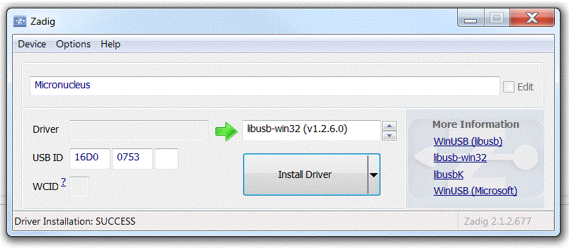

# Arduino
Arduino IDE in der Version 1.6.7 und die Erweiterung für das letsgoING-Programm
- ArduBlock ind der letsgoING-Variante [http://blog.ardublock.com/](http://blog.ardublock.com/)
- letsgoING-Libraries
- Attiny-Package
- Micronucleus-Treiber [https://github.com/micronucleus](https://github.com/micronucleus)

## Verwendung der Attiny-Platine ##
Um die Attiny-Platine verwenden zu können, muss zuerst der Micronucleus-Treiber installiert werden.
Dazu kann der Zadig-Installer verwendet werden (Tools/DriverInstaller).

### Windows Treiber-Installation mit Zadig ###
Zadig ist ein automatisiertes Treiber-Installationswerkzeug für libusb-Geräte.
Die neueste Version fidet man hier [http://zadig.akeo.ie/](http://zadig.akeo.ie/). Unter "tools/DriverInstaller" findet man eine Kopie.

Um den Micronucleus-Treiber zu installieren, muss man wie folgt vorgehen:

1. Starte Zadig_2.1.2.exe. Die unten gezeigte Oberfläche erscheint.
2. Über das Menü *Device->Load Preset Device* kann die Konfiguration geladen werden.
   --> wähle "micronucleus.cfg" aus
3. Klicke den "Install Driver" Knopf.

Der Treiber ist jetzt intalliert und die Attiny-Platine kann verwendet werden. 

 
